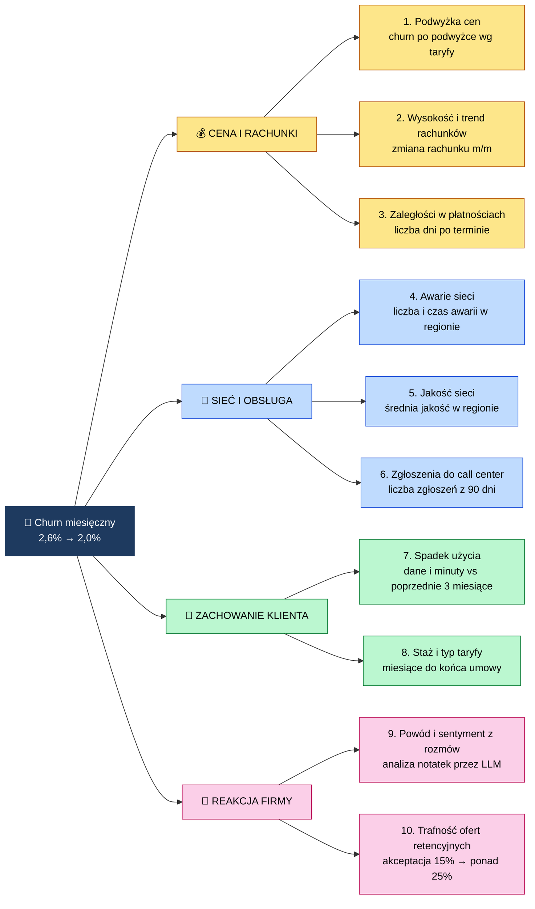

# 🌳 Drzewo KPI: co wpływa na churn

> [!NOTE]
> Dane są **syntetyczne**, a firma fikcyjna. Nazwy tabel i pól są **propozycją** i zostaną potwierdzone przy projektowaniu modelu danych (Faza 2 i 4). Opisy „dlaczego czynnik wpływa na churn" to **hipotezy biznesowe**, które zweryfikujemy w diagnozie (Faza 7).

**Cel główny:** churn miesięczny z **2,6% do ok. 2,0%** w 3 miesiące.

Drzewo pokazuje 10 czynników, które wpływają na churn, pogrupowanych w 4 gałęzie. Dalej opisuję każdy czynnik: skąd się bierze, w jakim systemie leży i w jakiej tabeli w BigQuery go przechowujemy.

## Spis treści

1. [Diagram](#1-diagram)
2. [Słowniczek: skąd i jak płyną dane](#2-słowniczek-skąd-i-jak-płyną-dane)
3. [Czynniki w skrócie](#3-czynniki-w-skrócie)
4. [Czynniki: opis szczegółowy](#4-czynniki-opis-szczegółowy)
5. [Miara główna: churn](#5-miara-główna-churn)
6. [Tabela rekomendacji](#6-tabela-rekomendacji)
7. [Droga danych do tabel](#7-droga-danych-do-tabel)

---

## 1. Diagram

---

## 2. Słowniczek: skąd i jak płyną dane

Zanim przejdziemy do czynników, krótko o pojęciach, które się powtarzają.

| Pojęcie | Co to jest | Przykład w projekcie |
|---|---|---|
| **Oracle (legacy)** | Stara, główna baza danych firmy. Tu żyją klienci, taryfy, faktury, płatności, użycie i zgłoszenia. | Faktura wystawiona klientowi w marcu |
| **Plik CSV** | Prosty plik tekstowy z tabelą (wiersze i kolumny), który ktoś wysyła lub eksportuje. Dane przychodzą partiami, np. raz dziennie. | Plik z listą awarii sieci |
| **Cloud Storage** | „Dysk w chmurze" Google. Trafiają tu surowe pliki, zanim wczytamy je do bazy. | Przychodzący plik CSV z awariami |
| **Datastream** | Usługa Google, która kopiuje dane z Oracle do BigQuery. Najpierw jednorazowo całą bazę, potem na bieżąco tylko zmiany (CDC, czyli „zmiany w danych na bieżąco"). | Klient zmienił taryfę, więc zmiana pojawia się w BigQuery po chwili |
| **Pub/Sub** | Usługa Google do przesyłania wiadomości i zdarzeń w czasie rzeczywistym. Opis niżej. | Stacja nadawcza wysyła co chwilę pomiar jakości sieci |
| **Dataflow** | Usługa, która odbiera zdarzenia z Pub/Sub, ewentualnie je przekształca i zapisuje do BigQuery. | Pomiar jakości zapisany jako wiersz w tabeli |
| **BigQuery** | Hurtownia danych Google. Tu leżą wszystkie tabele, na których liczymy i z których czyta Power BI. | Tabela `fact_faktury` |
| **Bronze, silver, gold** | Trzy warstwy porządkowania danych. **Bronze:** surowe, tak jak przyszły. **Silver:** oczyszczone (bez duplikatów, poprawione). **Gold:** gotowe do raportów i modeli. | Faktura przechodzi z bronze przez silver do gold |
| **Tabela faktów (`fact_`)** | Tabela zdarzeń, które się wydarzyły i które da się policzyć: faktura, płatność, awaria, zgłoszenie. | `fact_zgloszenia` |
| **Tabela wymiarów (`dim_`)** | Tabela opisowa: kim jest klient, czym jest taryfa, jaki to region. Fakty „zawieszają się" na wymiarach. | `dim_klient` |
| **Dataform** | Narzędzie, w którym piszemy przekształcenia danych z jednej warstwy w drugą. | Czyszczenie klientów do silver |

### Co to jest Pub/Sub

**Pub/Sub** (skrót od *publish/subscribe*, czyli „publikuj i subskrybuj") to usługa, która przenosi małe wiadomości od nadawców do odbiorców w czasie rzeczywistym.

Najłatwiej wyobrazić to sobie jako **tablicę ogłoszeń z powiadomieniami**:
- **Nadawca** (publisher) wiesza na tablicy krótką wiadomość i nie musi wiedzieć, kto ją przeczyta.
- Tablica ma nazwę, czyli **temat** (topic), np. „zdarzenia sieciowe".
- **Odbiorca** (subscriber) zapisuje się do tematu (**subskrypcja**) i dostaje każdą nową wiadomość, kiedy tylko się pojawi.

**Po co nam to w projekcie.** Sieć telekomunikacyjna produkuje pomiary jakości bez przerwy: co kilka sekund dla wielu stacji. Nie da się tego ładować raz dziennym plikiem CSV, bo dane byłyby spóźnione, a plików byłoby za dużo. Dlatego:

1. Stacje (u nas: program w Pythonie, który je symuluje) wysyłają pomiary do tematu w Pub/Sub.
2. **Dataflow** odbiera wiadomości i zapisuje je do BigQuery (warstwa bronze).
3. Błędne wiadomości trafiają do osobnego tematu „dead-letter", żeby nic nie zginęło po cichu.

**Dla porównania:** Oracle i CSV to dane „porcjami" (raz na jakiś czas), Pub/Sub to dane „strumieniem" (ciągle).

---

## 3. Czynniki w skrócie

| # | Czynnik | Źródło | Jak trafia do GCP | Tabela (gold) |
|---|---|---|---|---|
| 1 | Podwyżka cen | Oracle: cennik, taryfy | Datastream (CDC) | `dim_taryfa`, `fact_faktury` |
| 2 | Wysokość i trend rachunków | Oracle: faktury | Datastream (CDC) | `fact_faktury` |
| 3 | Zaległości w płatnościach | Oracle: płatności | Datastream (CDC) | `fact_platnosci` |
| 4 | Awarie sieci | Plik CSV od działu sieci | Cloud Storage → BigQuery | `fact_awarie` |
| 5 | Jakość sieci | Zdarzenia sieciowe | Pub/Sub → Dataflow → BigQuery | `fact_jakosc_sieci` |
| 6 | Zgłoszenia do call center | Oracle: system zgłoszeń | Datastream (CDC) | `fact_zgloszenia` |
| 7 | Spadek użycia | Oracle: użycie | Datastream (CDC) | `fact_uzycie` |
| 8 | Staż i typ taryfy | Oracle: klient, SIM, taryfa | Datastream (CDC) | `dim_klient`, `dim_sim`, `dim_taryfa` |
| 9 | Powód i sentyment z rozmów | Transkrypcje rozmów | Cloud Storage → Gemini → BigQuery | `fact_rozmowy_analiza` |
| 10 | Trafność ofert retencyjnych | Model rekomendacji i zdarzenia sprzedaży | Zapis do BigQuery | `fact_rekomendacje` |

---

## 4. Czynniki: opis szczegółowy

Przy każdym czynniku odpowiadam na pięć pytań: dlaczego wpływa na churn, co dokładnie mierzymy, skąd dane, w jakiej tabeli leżą i kto jest odpowiedzialny za jakość tych danych.

### Gałąź A: Cena i rachunki

#### 1. Podwyżka cen

- **Dlaczego wpływa:** w styczniu abonamenty podrożały średnio o 8%. Klienci, którzy dostali wyższy rachunek, szukają tańszych ofert u konkurencji. Hipoteza: najmocniej odchodzą ci z najtańszymi taryfami, bo dla nich 8% to względnie dużo.
- **Co mierzymy:** churn w każdej taryfie przed i po podwyżce oraz wielkość podwyżki w złotych dla klienta.
- **Źródło:** system Oracle: cennik i przypisanie klienta do taryfy.
- **Tabele (gold):** `dim_taryfa` (opis taryfy) i `fact_faktury` (kwoty przed i po podwyżce).
- **Główne pola:** `taryfa_id`, `nazwa_taryfy`, `cena_miesieczna`, `data_zmiany_ceny`, `cena_przed_zmiana`.
- **Właściciel danych:** Inżynier danych.

#### 2. Wysokość i trend rachunków

- **Dlaczego wpływa:** nie tylko podwyżka cennika, ale też każdy nieoczekiwanie wyższy rachunek (np. roaming, dodatkowe usługi) zwiększa ryzyko rezygnacji.
- **Co mierzymy:** kwota ostatniej faktury i zmiana względem poprzedniego miesiąca w procentach.
- **Źródło:** Oracle: faktury.
- **Tabela (gold):** `fact_faktury`.
- **Główne pola:** `faktura_id`, `klient_id`, `data_faktury`, `kwota`, `taryfa_id`, `termin_platnosci`.
- **Właściciel danych:** Inżynier danych.

#### 3. Zaległości w płatnościach

- **Dlaczego wpływa:** klient, który zaczyna spóźniać się z płatnościami, często ma kłopot finansowy albo jest niezadowolony i „przestaje dbać" o relację z operatorem.
- **Co mierzymy:** liczba dni po terminie i liczba niezapłaconych faktur.
- **Źródło:** Oracle: płatności.
- **Tabela (gold):** `fact_platnosci`.
- **Główne pola:** `platnosc_id`, `faktura_id`, `klient_id`, `data_platnosci`, `kwota`, `dni_po_terminie`.
- **Właściciel danych:** Inżynier danych.

### Gałąź B: Sieć i obsługa

#### 4. Awarie sieci

- **Dlaczego wpływa:** w lutym była 5-dniowa awaria w regionie południowo-wschodnim. Klient bez zasięgu płaci za usługę, której nie dostaje. Hipoteza: churn w tym regionie wzrósł wyraźnie mocniej niż w pozostałych.
- **Co mierzymy:** liczba awarii, czas trwania, region, liczba dotkniętych klientów.
- **Źródło:** plik CSV z awariami, który przygotowuje dział sieci. Przychodzi partiami.
- **Tabela (gold):** `fact_awarie`.
- **Główne pola:** `awaria_id`, `region_id`, `data_start`, `data_koniec`, `czas_trwania_godz`, `typ_awarii`.
- **Właściciel danych:** Inżynier danych (dostarcza dział sieci).

#### 5. Jakość sieci

- **Dlaczego wpływa:** nawet bez dużej awarii słaby zasięg, niska prędkość i przerwane połączenia drażnią klientów dzień po dniu.
- **Co mierzymy:** średni wskaźnik jakości w regionie w danym tygodniu (np. prędkość, opóźnienie, liczba zerwanych połączeń).
- **Źródło:** strumień zdarzeń sieciowych. Stacje wysyłają pomiary na bieżąco do **Pub/Sub** (wyjaśnienie w sekcji 2).
- **Tabela (gold):** `fact_jakosc_sieci`.
- **Główne pola:** `zdarzenie_id`, `region_id`, `czas_zdarzenia`, `wskaznik_jakosci`, `typ_wskaznika`.
- **Właściciel danych:** Inżynier danych.

#### 6. Zgłoszenia do call center

- **Dlaczego wpływa:** wiele zgłoszeń z ostatnich tygodni to sygnał, że klient ma problem. Nierozwiązane zgłoszenie to jeden z najsilniejszych znanych sygnałów odejścia.
- **Co mierzymy:** liczba zgłoszeń klienta z ostatnich 90 dni, ich kategoria, czas rozwiązania, czy zostały zamknięte.
- **Źródło:** Oracle: system zgłoszeń.
- **Tabela (gold):** `fact_zgloszenia`.
- **Główne pola:** `zgloszenie_id`, `klient_id`, `data_zgloszenia`, `kategoria`, `status`, `czas_rozwiazania_godz`.
- **Właściciel danych:** Inżynier danych.

### Gałąź C: Zachowanie klienta

#### 7. Spadek użycia

- **Dlaczego wpływa:** klient, który nagle korzysta z telefonu mniej niż zwykle, często już przenosi się do innej sieci (np. używa drugiej karty SIM u konkurenta).
- **Co mierzymy:** ilość danych i minut w ostatnim miesiącu w porównaniu ze średnią z 3 poprzednich.
- **Źródło:** Oracle: użycie.
- **Tabela (gold):** `fact_uzycie`.
- **Główne pola:** `klient_id`, `sim_id`, `miesiac`, `dane_gb`, `minuty`, `liczba_sms`.
- **Właściciel danych:** Inżynier danych.

#### 8. Staż i typ taryfy

- **Dlaczego wpływa:** klient w ostatnich miesiącach umowy łatwiej odchodzi, bo nie płaci kary. Staż i typ taryfy pomagają też odróżnić klientów lojalnych od tych „na próbę".
- **Co mierzymy:** staż klienta w miesiącach, typ taryfy, ile miesięcy zostało do końca umowy.
- **Źródło:** Oracle: klient, SIM, taryfa.
- **Tabele (gold):** `dim_klient`, `dim_sim`, `dim_taryfa`.
- **Główne pola (`dim_klient`):** `klient_id`, `data_aktywacji`, `status`, `data_konca_umowy`, `data_rozwiazania`, `region_id`. Tabela przechowuje historię zmian klienta (typ SCD 2: każda zmiana to nowa wersja wiersza z datą od-do).
- **Właściciel danych:** Inżynier danych.

### Gałąź D: Reakcja firmy

#### 9. Powód i sentyment z rozmów

- **Dlaczego wpływa:** z rozmów retencyjnych dowiadujemy się, dlaczego klienci naprawdę odchodzą i kto im oferuje lepsze warunki. Bez tej analizy firma zgaduje.
- **Co mierzymy:** powód odejścia (np. cena, awaria, konkurencja), sentyment rozmowy, wspomniany konkurent.
- **Źródło:** transkrypcje rozmów sprzedawców z klientami. Model Gemini odczytuje każdą rozmowę i wyciąga z niej powód, sentyment i konkurenta.
- **Tabela (gold):** `fact_rozmowy_analiza`.
- **Główne pola:** `rozmowa_id`, `klient_id`, `data_rozmowy`, `powod_odejscia`, `sentyment`, `konkurent`, `pewnosc_modelu`.
- **Właściciel danych:** Inżynier AI.

#### 10. Trafność ofert retencyjnych

- **Dlaczego wpływa:** dziś akceptacja ofert retencyjnych to ok. 15%, bo oferty są dobierane „na oko". Trafniejsza oferta oznacza więcej uratowanych klientów.
- **Co mierzymy:** udział zaakceptowanych rekomendacji w tych, które klient zobaczył. Cel: z 15% do ponad 25%.
- **Źródło:** model rekomendacji ofert i zdarzenia ze sprzedaży (rekomendacja wyświetlona, zaakceptowana, odrzucona).
- **Tabela (gold):** `fact_rekomendacje` (opis w sekcji 6).
- **Właściciel danych:** Data Scientist.

---

## 5. Miara główna: churn

Churn nie jest osobnym czynnikiem. To wynik, który tłumaczymy czynnikami 1-10.

- **Definicja (do zatwierdzenia z Analitykiem Power BI):** klient odszedł w danym miesiącu, jeśli jego umowa została rozwiązana w tym miesiącu.
- **Wzór:** churn miesięczny = liczba klientów, którzy odeszli w miesiącu / liczba klientów na początku miesiąca.
- **Źródło:** `dim_klient` (pola `status` i `data_rozwiazania`).
- **Przykład:** 500 000 klientów na początku miesiąca i 13 000 odejść daje churn 2,6%.

**Wymiary wspólne dla wszystkich faktów:** `dim_czas` (data) i `dim_region` (region klienta). Dzięki nim każdy czynnik można pokazać w czasie i w podziale na regiony.

---

## 6. Tabela rekomendacji

`fact_rekomendacje` zasila raport rekomendacji dla Lidera Sprzedawców (US-02). Jeden wiersz to jedna rekomendacja przygotowana dla jednego klienta.

| Pole | Opis | Przykład |
|---|---|---|
| `id_rekomendacji` | Unikalny numer rekomendacji | REK-000123 |
| `klient_id` | Klient, którego dotyczy rekomendacja | K-45821 |
| `nazwa_kampanii` | Kampania, z której pochodzi rekomendacja | Retencja po podwyżce Q1 |
| `oferta` | Zaproponowana oferta | Abonament 80 GB z rabatem 15% |
| `data` | Data utworzenia rekomendacji | 2026-03-14 |
| `status_ostatni` | Ostatni znany status: **wyświetlona**, **zaakceptowana** albo **odrzucona** | zaakceptowana |
| `kanal_sprzedazy` | Kanał, którym oferta jest przedstawiana (np. infolinia, sklep, aplikacja) | infolinia |
| `opiekun_sprzedazy` | Sprzedawca odpowiedzialny za klienta w tej rekomendacji | Anna K. |

**Jak działa status.** Rekomendacja zaczyna jako „wyświetlona", kiedy sprzedawca ją zobaczy. Potem zmienia status na „zaakceptowana" albo „odrzucona", zależnie od decyzji klienta. Tabela trzyma **ostatni status**. Jeśli później będziemy chcieli widzieć całą historię zmian (np. ile dni minęło od wyświetlenia do decyzji), dodamy osobną tabelę zdarzeń.

**Skąd dane.** Rekomendacje tworzy model Data Scientista, a statusy zapisują się, kiedy sprzedawca pracuje z klientem. W danych syntetycznych statusy wygeneruje skrypt w Pythonie (Faza 2).

---

## 7. Droga danych do tabel

| Źródło | Droga do GCP | Warstwa surowa (bronze) |
|---|---|---|
| **Oracle** (klient, SIM, taryfa, faktury, płatności, użycie, zgłoszenia) | Datastream: jednorazowy backfill, potem zmiany na bieżąco (CDC) | `bronze.oracle_*` |
| **Plik CSV** (awarie sieci) | Cloud Storage → ładowanie do BigQuery | `bronze.csv_awarie` |
| **Zdarzenia sieciowe** (jakość sieci) | Pub/Sub → Dataflow → BigQuery | `bronze.stream_jakosc_sieci` |
| **Transkrypcje rozmów** | Cloud Storage → analiza Gemini → BigQuery | `bronze.rozmowy_surowe` |
| **Rekomendacje** | Model Data Scientista i zdarzenia sprzedaży → BigQuery | `bronze.rekomendacje` |

Dalej: **bronze → silver** (czyszczenie, usuwanie duplikatów, ostatnia wersja rekordu z CDC) → **gold** (wymiary i fakty, czyli schemat gwiazdy). Przekształcenia robi Dataform, a raporty w Power BI czytają warstwę gold.
